# Lab1

## 要求及公告

提供4种不同算法代码，可以直接使用 不强制自己重新实现一遍

lab1重点关注并行部分 不关心数独算法如何实现 只关心如何做到并行

---

## 实验介绍

folder→云计算技术/lab1 

并行编程

git工具 及 github协作

实验报告

输入多个文件名    每个文件里每一行是一个数独题

按顺序输出结果    一个结果一行

## 实验过程

### 首先观察src内的sudoku文件夹：

main 初始化/调用初始化函数/ 读取文件并按照参数选择一个算法 解决数独问题 /记录时间差 计算得到性能

neighbor 及 .h文件 用于设置数独相关

makefile文件 方便使用make指令 编译所有代码

四种算法cc文件

---

### 查看main文件：

fopen函数的参数 

[http://c.biancheng.net/view/2054.html](http://c.biancheng.net/view/2054.html)

[https://www.cnblogs.com/yanglai/p/6927151.html](https://www.cnblogs.com/yanglai/p/6927151.html) 

原本fopne（“文件名”，“打开方式”） r表示只读 

而argv是main的参数， 是打开sudoku程序时的参数

查看上面第二个链接： 

要用编译后的程序解决test1里的数独 需要输入 

    ./suduko test1
    
    ./sudoku test1 a

解决数独采用的算法 由第二个参数决定 于是在ter输入不同指令测试不同算法所需时间：

由此可知dance算法的速度最快 basic算法最慢

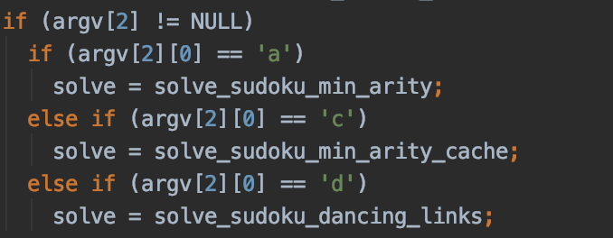

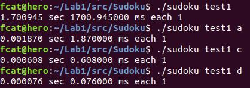

---

### 修改输出

原本的输出只有时间统计，在原本的函数基础上增添代码，使输出填了数字后的数独

在main函数的相应位置：

    if (solve(0)) {        
    	++total_solved;	
    	int i1;	
    	for(i1=0;i1<N;i1++) printf("%d",board[i1]);	
    	printf("\n");	        
    	if (!solved())          
    	assert(0);      
    }

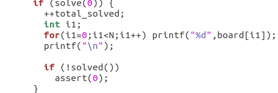

---

### 修改输入

原本测试文件名是作为打开程序时的参数一同输出 

先修改代码 改为在打开程序后在输入测试文件名 方便以后进一步修改实现 多文件输入

同时将数独算法默认为dance算法 因为它最快

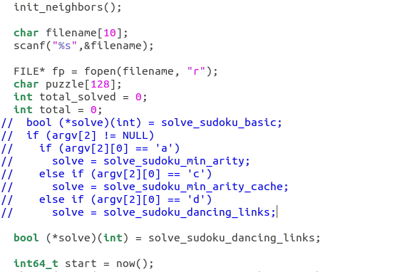

---

### makefile修改及编写

$@--目标文件，$^--所有的依赖文件

将冒号后面所有的依赖文件 生成 对应名字的目标文件

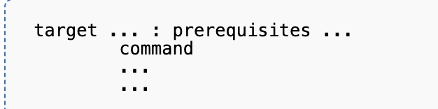

由于后续需要使用线程库，所以makefile最后gcc一行 加入 -lpthrad

---

### 多线程编程

相比于 用多个线程同时解决单个数独题然后依次类推 

用多线程同时解决多个数独题 更容易实现，加速效果也更好

首先想到的是 每一个数独开一个线程，但是对于1000个数独开设1000个线程是很大的负担

于是设想 开设10个线程处理1000个数独，理想情况是每个线程处理100个数独

1、动态获取

但可能有的数独难解决一些（我这么想的），所以线程动态获取数独去解决 比 我静态分配给每个线程固定的100个数独要快一些

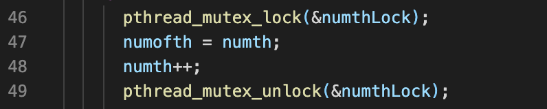

于是在线程函数里 根据全局变量numth记录当前等待处理的下一个数独位置，线程抓取后继续将指针向后推移

2、共享变量

原来的代码文件之间有很多全局（外部）共享变量 ， 若只是单单对访问这些变量时上锁互斥，那由于每种类型只有一个变量，其他线程都在等待，速度并不会提升

于是将每个变量增加至与线程数相同，每个线程使用一组共享变量

同时 对于数独算法等函数增加一个参数num 用来识别当前是那个线程该用哪组变量 防止线程间数据错误（临界区）

3、输入

重新修改输入，先循环读取文件，将所有数独读取到puzzle数组中

然后再开始创建并分配线程

4、输出

考虑到输出要求 每一行按顺序下来 对应到 输入的每一行按顺序下来的答案

于是不再实时输出，而是将所有结果保存到一个数组中，在所有线程结束后，在父进程输出全部答案

### 进一步优化处：

多文件读入 （在文件输入部分稍加修改应该就能实现）

输出到文件 

增设读入线程（参数传输要注意） 和 分配任务线程

优化数据存储 ：如输入数据的存储 以及 多个线程的全局变量有没有更好的处理方法

如何动态按需创建线程（即数量不提前固定）

原来代码使用方法：

./sudoku test1

本代码使用方法：

./sudoku_solve

test1000

---

### 时间对比

单线程：

原来代码各种算法下时间：

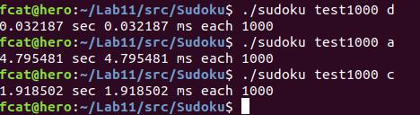

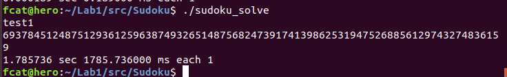

dance算法 ——test1000

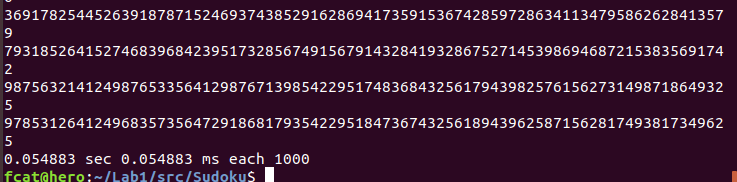

basic算法——test1000

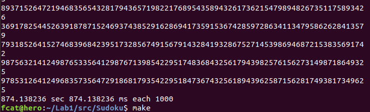

多线程： basic算法——test1000

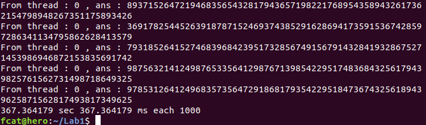

以上是用Ubuntu虚拟机测试所得 （1 CPU  4 核）

以下是mac的测试结果（basic算法 ）

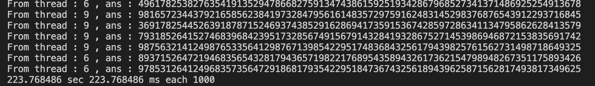

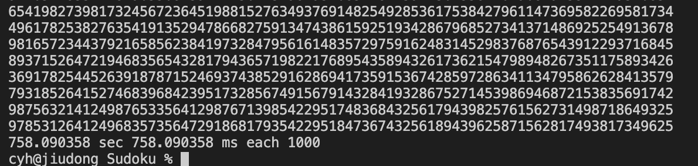